# System Flowcharts and Block Diagrams — Autonomous Garbage Collector Robot

> All diagrams are rendered in Mermaid. All layouts are designed for A4 paper printing.

---

## 1. System-Level Block Diagram

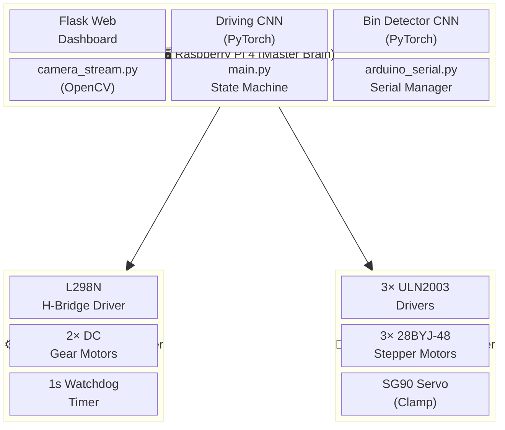

---

## 2. Power Architecture Block Diagram

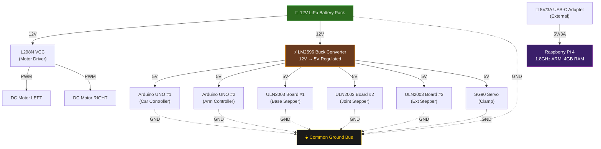

---

## 3. Main State Machine Flowchart

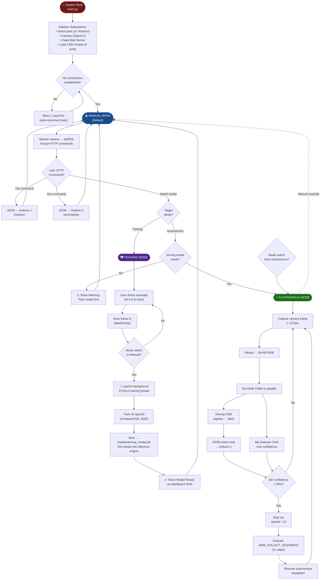

---

## 4. Dual-CNN Inference Pipeline

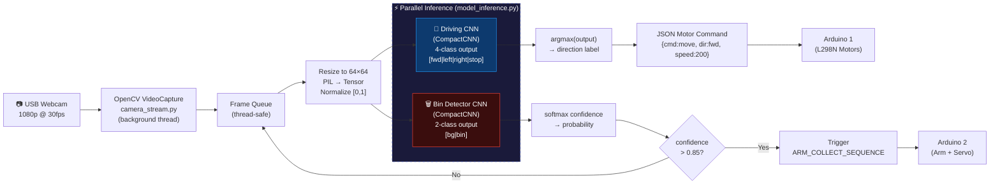

---

## 5. Robotic Arm Architecture Diagram

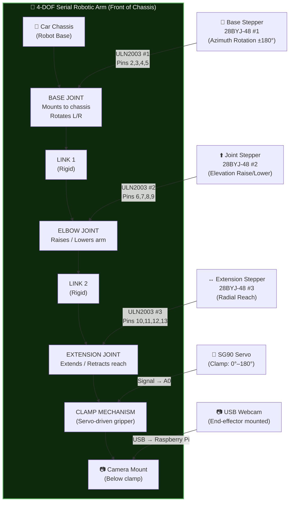

---

## 6. Garbage Collection Sequence Flowchart

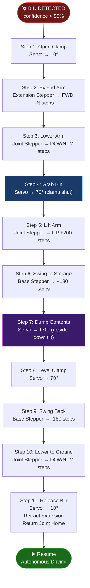

---

## 7. Training Pipeline Flowchart

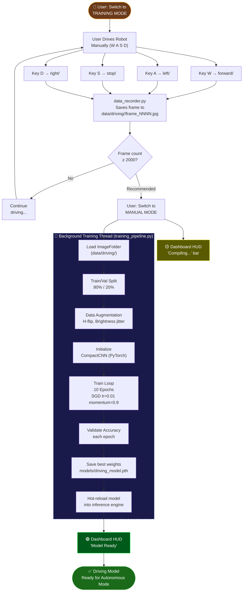

---

## 8. Serial Communication Protocol Flowchart

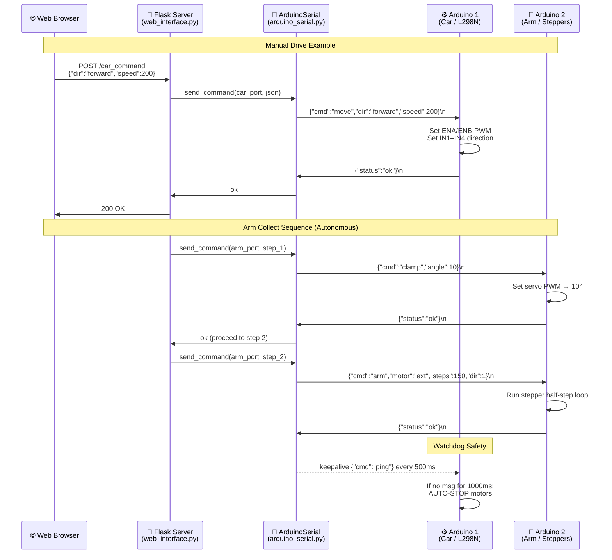

---

## 9. Web Dashboard Architecture Diagram

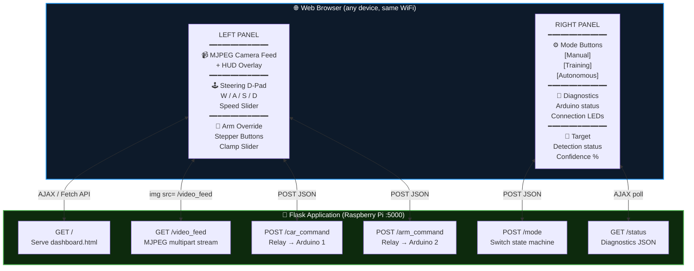

---

## 10. Arduino Wiring Block Diagrams

### Arduino 1 — Car Motor Controller

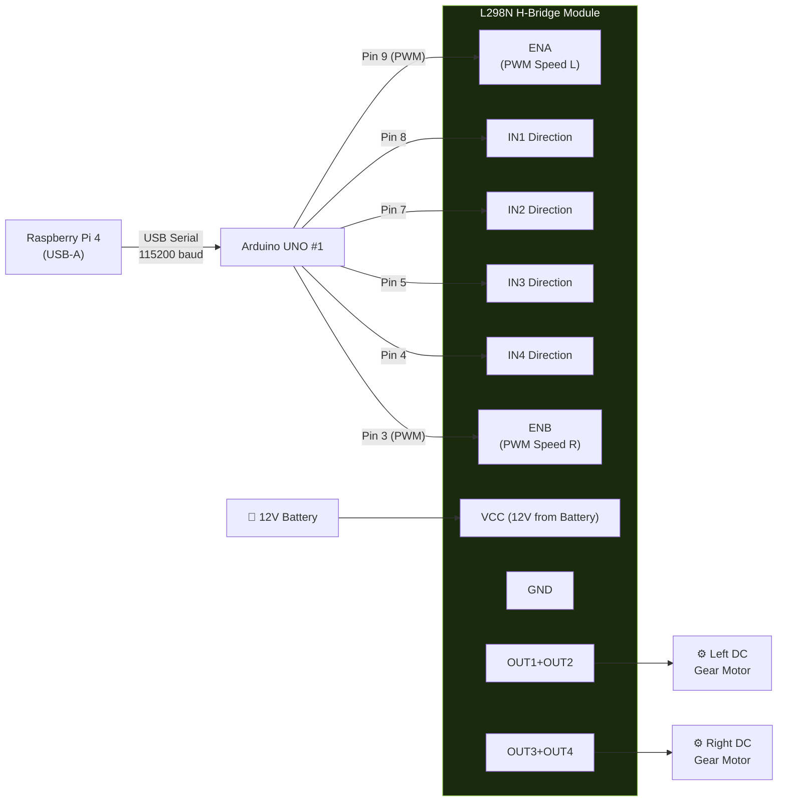

### Arduino 2 — Robotic Arm Controller

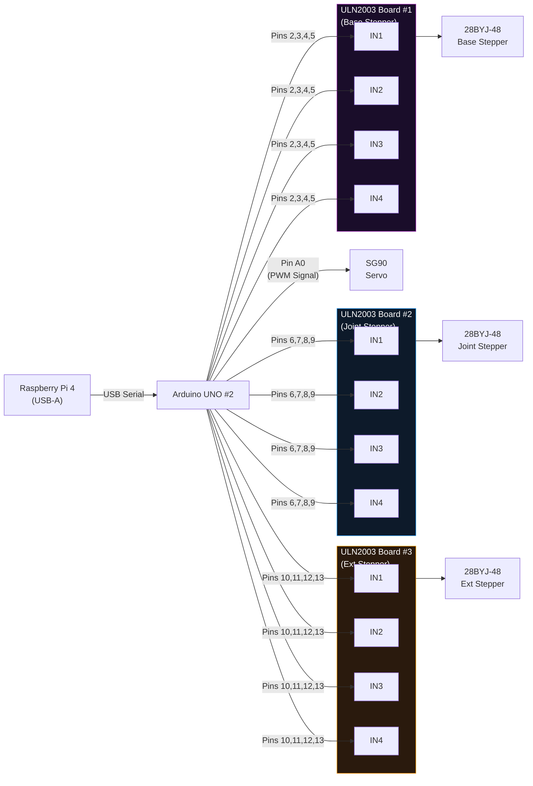

---

## 11. Software Module Dependency Diagram

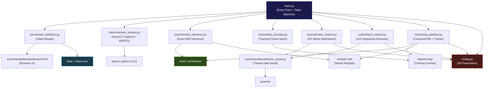

---

*Diagrams generated for: Autonomous Garbage Collector Robot*  
*GitHub: https://github.com/rakesh-i/ESP32-Autonomous-car*  
*Format: A4 — All diagrams are Mermaid-compatible*
